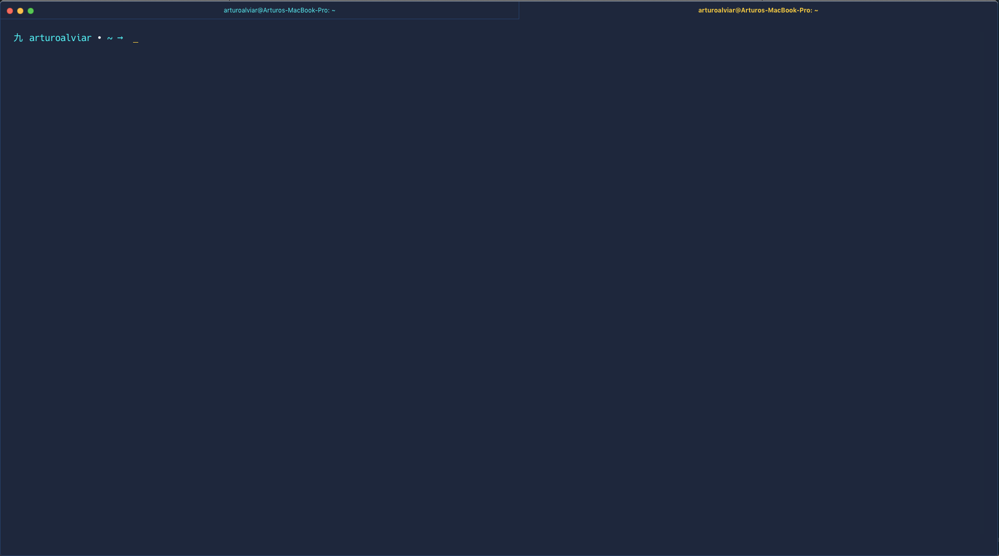

# Kyuu ZSH theme
Kyuu is a simple theme with the first character being 九(kyuu), the number 9. The primary color is blue with a magenta accent.

---

## Screenshot

---

## Installation
Copy the kyuu.zsh-theme file into your local oh-my-zsh/themes folder (usually found in your home directory ~/.oh-my-zsh/). Then set you ZSH_THEME to the name of the desired theme in the kyuu.zshrc file.

---

## License
The MIT License.
